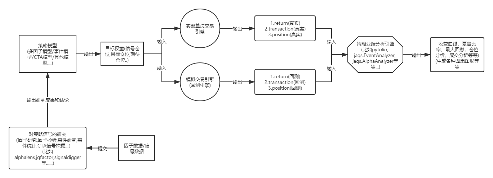

# SUSTech量化实验室Alpha研究平台


# 整体流程图




# 远程文件操作接口

> 注意：开发阶段更新频繁，如果遇到问题请联系管理员。

## 快速开始


**配置文件researcher_config.ini中包括了对应研究员的信息,请根据实际情况进行修改**
```
host=<研究服务器地址>
port=27017
researcher_id=<你的研究员ID>
password=<你的研究员密码>
```

远程文件操作接口提供了基本的因子/信号文件上传功能。

- Python 接口
  ```python
  import researcher_api as ra
  #读取样例信号数据
  factor_df = pd.read_csv(os.path.join('sample.csv'), index_col=[0], engine='python', encoding='gbk')
  #上传因子数据
  ra.write_to_datahouse(dat_val=factor_df, dat_name="sample_factor")
  ```

## 上传操作 write_to_datahouse

该操作会将`dat_val`上传到远程文件数据库中，保存到文件名为`dat_name`的文件中。

| 参数名称 | 参数值类型 | 是否必须填写 | 参数说明 |
| ------ | ------ | ------ | ------ |
| dat_val | Dataframe | 是 | 数据值，仅支持行列式数据，行是时间(必须是类似20190608这种格式)，列是标的符号(Wind和Tushare方式如000001.SZ) |
| dat_name | str | 是 | 数据名称 |

# 信号研究服务

## 为什么需要信号

信号代表了模型对标的的预期，并给出了定量的买卖目标。好的模型能给出有效的信号，进而转化为模型在相关标的上的主动收益。完整的量化交易策略包含信号计算、交易指令、仓位管理、资金管理等多个方面，其中信号研究是一个重要组成部分，一般包括alpha信号研究、事件驱动信号研究、CTA信号研究等功能。

## 常用的信号评估方法

我们问“信号是否有效”，就是想问“在信号满足某些条件下的条件分布，和无条件分布是否有区别”。一般有：

- 收益分析：收益的分布、均值、标准差，累计收益等；
- 相关性分析：信号值与收益的相关系数、秩相关系数等

## 快速开始

### 股票alpha信号分析（多标的）

对于股票alpha信号，我们主要关注**横截面数据**，即每个交易日投资范围内所有股票的数据。对任意一个交易日，各个股票的信号和各个股票的收益（可以是n天的收益）构成一组数据点，可以分多组比较平均收益，也可以计算相关系数。下面为示例代码：

```python
import researcher_api as ra

requests =  {
    "task": {
        "type": "factor_evaluate_report",  #任务类型:因子检验
        "start_date": 20150101,            #开始时间
        "end_date": 20181231,              #结束时间
        "universe": '000300.SH',           #选股空间
        "benchmark": '000300.SH',          #对比基准
        "signal_name": "sample_factor",    #因子名称(如果下面的公式字段不存在就直接从文件中读取)
        "formula": 'Abs((open - Delay(close, 1)) / Delay(close, 1))', #因子(信号)计算公式
        "quantiles": 5,                    #分为几组
        "period": 22                       #计算收益周期
    }
}

ra.submit_task(requests) #提交任务
```

- 请求参数说明

参数名称|参数值类型|是否必须填写|参数说明
------|:--:|:--:|:--
type|str|是|任务类型
start_date|int|是|数据开始时间
end_date|int|是|数据结束时间
universe|str|是|选股空间
benchmark|str|是|对比基准
signal_name|str|是|因子(信号)名称
formula|str|是|因子(信号)计算公式
quantiles|int|是|分为几组
period|int|是|计算收益周期


### CTA信号分析（单标的）

对于单标的，信号组成的时间序列数据和标的价格组成的时间序列数据共同构成一组数据点，用于分析。我们同样根据信号值大小进行分组，比较每一组在信号出现后n天的收益均值、标准差；也可以计算信号与收益的相关系数。

```python
import researcher_api as ra

requests =  {
    "task": {
        "type": "single_signal_report", #任务类型:时序信号研究
        "start_date": 20150101,         #开始时间
        "end_date": 20181231,           #结束时间
        "universe": None,               #选股空间,必须为空
        "benchmark": None,              #对比基准,必须为空
        "symbol": "000001.SZ",          #研究标的符号
        "signal_name": "sample_factor", #信号名称(如果下面的公式字段不存在就直接从文件中读取)
        "formula": 'Abs((open - Delay(close, 1)) / Delay(close, 1))', #因子(信号)计算公式
        "quantiles": 5,                 #分为几组
        "periods": [20, 40, 60, 120]    #计算收益周期
    }
}

ra.submit_task(requests) #提交任务
```

- 请求参数说明

参数名称|参数值类型|是否必须填写|参数说明
------|:--:|:--:|:--
type|str|是|任务类型
start_date|int|是|数据开始时间
end_date|int|是|数据结束时间
symbol|str|是|研究标的符号
signal_name|str|是|因子(信号)名称
formula|str|是|因子(信号)计算公式
quantiles|int|是|分为几组
periods|list|是|计算收益周期


### 事件驱动信号分析（多标的）

对于事件驱动信号分析来说，我们统计在研究周期内此事件在选股范围内总共发生的次数，以及事件发生后n天的收益均值、标准差等等。

```python
import researcher_api as ra

requests =  {
    "task": {
        "type": "binary_event_report", #任务类型:事件研究
        "start_date": 20150101,        #开始时间
        "end_date": 20181231,          #结束时间
        "universe": '000300.SH',       #选股空间
        "benchmark": '000300.SH',      #对比基准
        "signal_name": "event_index_enter", #事件名称(如果下面的公式字段不存在就直接从文件中读取)
        "formula": '(Delay(index_member, 1) == 0) && (index_member > 0)', #因子(信号)计算公式
        "periods": [20, 40, 60, 120]   #计算收益周期
    }
}

ra.submit_task(requests) #提交任务
```

- 请求参数说明

参数名称|参数值类型|是否必须填写|参数说明
------|:--:|:--:|:--
type|str|是|任务类型
start_date|int|是|数据开始时间
end_date|int|是|数据结束时间
universe|str|是|选股空间
benchmark|str|是|对比基准
signal_name|str|是|因子(信号)名称
formula|str|是|因子(信号)计算公式
periods|list|是|计算收益周期


## 公式说明

`formula`是用字符串表示的数学公式。抽象来看`formula`具有以下形式：
$$
f( x_1, x_2, \dots, x_n)
$$
其中$f$是下方列表中支持的运算或函数，$x_i$为`研究平台`中已经存在的字段名。

### formula运算时的几个默认操作

1. 指数成分：如果设置了某指数选股空间，因为每天universe的股票是有可能变化的，在进行一些横截面运算时（如排序），会先将当天非指数成分的数据置为NaN，再运算
2. 季度数据的自动展开和对齐：当不同频率的数据一起运算时，会将季度数据按照公布日期(ann_date)展开并对齐到交易日，再和日频数据运算。

### 公式支持的运算、函数说明

| 分类                | 说明                                       | 公式                              | 示例                                       |
| ----------------- | ---------------------------------------- | ------------------------------- | ---------------------------------------- |
| 四则运算              | 加法运算                                     | +                               | close + open                             |
| 四则运算              | 减法运算                                     | -                               | close - open                             |
| 四则运算              | 乘法运算                                     | *                               | vwap * volume                            |
| 四则运算              | 除法运算                                     | /                               | close / open                             |
| 基本数学函数            | 符号函数，返回值为{-1,   0, 1}                    | Sign(x)                         | Sign(close-open)                         |
| 基本数学函数            | 绝对值函数                                    | Abs(x)                          | Abs(close-open)                          |
| 基本数学函数            | 自然对数                                     | Log(x)                          | Log(close/open)                          |
| 基本数学函数            | 对x取负                                     | -x                              | -close                                   |
| 基本数学函数            | 幂函数                                      | ^                               | close ^ 2                                |
| 基本数学函数            | 幂函数x^y                                   | Pow(x,y)                        | Pow(close,2)                             |
| 基本数学函数            | 保持符号的幂函数，等价于Sign(x)   * (Abs(x)^e)       | SignedPower(x,e)                | SignedPower(close-open, 0.5)             |
| 基本数学函数            | 取余函数                                     | %                               | oi % 10                                  |
| 逻辑运算              | 判断是否相等                                   | ==                              | close == open                            |
| 逻辑运算              | 判断是否不等                                   | !=                              | close != open                            |
| 逻辑运算              | 大于                                       | >                               | close > open                             |
| 逻辑运算              | 小于                                       | <                               | close < open                             |
| 逻辑运算              | 大于等于                                     | >=                              | close >= open                            |
| 逻辑运算              | 小于等于                                     | <=                              | close <= open                            |
| 逻辑运算              | 逻辑与                                      | &&                              | (close > open) && (close > vwap)         |
| 逻辑运算              | 逻辑或                                      |                                 |                                          |
| 逻辑运算              | 逻辑非                                      | !                               | !(close>open)                            |
| 逻辑运算              | 判断值是否为NaN                                | IsNan(x)                        | IsNan(net_profit)                        |
| 三角函数              | 正弦函数                                     | Sin(x)                          | Sin(close/open)                          |
| 三角函数              | 余弦函数                                     | Cos(x)                          | Cos(close/open)                          |
| 三角函数              | 正切函数                                     | Tan(x)                          | Tan(close/open)                          |
| 三角函数              | 开平方函数                                    | Sqrt(x)                         | Sqrt(close^2 + open^2)                   |
| 取整函数              | 向上取整                                     | Ceil(x)                         | Ceil(high)                               |
| 取整函数              | 向下取整                                     | Floor(x)                        | Floor(low)                               |
| 取整函数              | 四舍五入                                     | Round(x)                        | Round（close）                             |
| 选择函数              | 取 x 和 y 同位置上的较大值组成新的DataFrame返回          | Max(x,y)                        | Max(close, open)                         |
| 选择函数              | 取   x 和 y 同位置上的较小值组成新的DataFrame返回        | Min(x,y)                        | Min(close,open)                          |
| 选择函数              | cond为True取x的值，反之取y的值                     | If(cond,x,y)                    | If(close > open, close,   open) 表示取open和close的较大值 |
| 时间序列函数 - 基本数学运算   | 指标n个周期前的值                                | Delay(x,n)                      | Delay(close,1) 表示前一天收盘价                  |
| 时间序列函数 -   基本数学运算 | 指标在过去n天的和                                | Ts_Sum(x,n)                     | Sum(volume,5) 表示一周成交量                    |
| 时间序列函数 - 基本数学运算   | 指标在过去   n 天的积                            | Ts_Product(x,n)                 | Product(close/Delay(close,1),5) - 1 表示过去5天累计收益 |
| 时间序列函数 -   基本数学运算 | 指标当前值与n天前的值的差                            | Delta(x,n)                      | Delta(close,5)                           |
| 时间序列函数 - 基本数学运算   | 计算指标相比n天前的变化率，默认计算百分比变化率；当log为1是，计算对数变化率 | Return(x,n,log)                 | Return(close,5,True)计算一周对数收益             |
| 时间序列函数 -   基本数学运算 | 计算指标在过去n天的平均值                            | Ts_Mean(x，n)                    | Ts_Mean(close,5)                         |
| 时间序列函数 - 统计       | 指标在过去n天的标准差                              | StdDev(x,n)                     | StdDev(close/Delay(close,1)-1, 10)       |
| 时间序列函数 - 统计       | 两个指标在过去n天的协方差                            | Covariance(x,y,n)               | Covariance(close, open,   10)            |
| 时间序列函数 - 统计       | 两个指标在过去n天的相关系数                           | Correlation(x,y,n)              | Correlation(close,open, 10)              |
| 时间序列函数 - 统计       | 计算指标在过去n天的最小值                            | Ts_Min(x，n)                     | Ts_Min(close，5)                          |
| 时间序列函数 - 统计       | 计算指标在过去n天的最大值                            | Ts_Max(x，n)                     | Ts_Max(close，5)                          |
| 时间序列函数 - 统计       | 计算指标在过去n天的偏度                             | Ts_Skewness(x，n)                | Ts_Skewness(close，20)                    |
| 时间序列函数 - 统计       | 计算指标在过去n天的峰度                             | Ts_Kurtosis(x，n)                | Ts_Kurtosis(close，20)                    |
| 时间序列函数 - 排名       | 计算指标在过去n天的排名，返回值为名次                      | Ts_Rank(x, n)                   | Ts_Rank(close, 5)                        |
| 时间序列函数 - 排名       | 计算指标在过去n天的百分比，返回值为[0.0,   1.0]           | Ts_Percentile(x,   n)           | Ts_Percentile(close, 5)                  |
| 时间序列函数 - 排名       | 计算指标在过去n天所属的quantile，返回值为表示quantile的整数   | Ts_Quantile(x, n)               | Ts_Quantile(close, 5)                    |
| 时间序列函数 - 排名       | 指数移动平均，以halflife的衰减对x进行指数移动平均            | Ewma(x,   halflife)             | Ewma(x, 3)                               |
| 横截面函数 - 排名        | 将指标值在横截面方向排名，返回值为名次                      | Rank(x)                         | Rank(   close/Delay(close,1)-1 ) 表示按日收益率进行排名 |
| 横截面函数 - 排名        | 按分组数据g在每组内将指标值在横截面方向排名，返回值为名次            | GroupRank(x,g)                  | GroupRank(close/Delay(close,1)-1, g)   表示按分组g根据日收益率进行分组排名 |
| 横截面函数 - 排名        | 将指标值在横截面方向排名，返回值为排名百分比                   | Percentile(x)                   | Percentile(close, sw1)   按申万1级行业         |
| 横截面函数 - 排名        | 按分组数据g在每组内将指标值在横截面方向排名，返回值为排名百分比         | GroupPercentile(x,   g, n)      |                                          |
| 横截面函数 - 排名        | 和Rank函数相同，但只有 cond 中值为True的标的参与排名        | ConditionRank(x, cond)          | GroupRank(close/Delay(close,1)-1,   cond) 表示按条件cond根据日收益率进行分组排名 |
| 横截面函数 - 排名        | 根据指标值在横截面方向将标的分成n个quantile，返回值为所属quantile | Quantile(x,   n)                | Quantile( close/Delay(close,1)-1,5)表示按日收益率分为5档 |
| 横截面函数 - 排名        | 按分组数据g在每组内根据指标值在横截面方向将标的分成n个quantile，返回值为所属quantile | GroupQuantile(x, g, n)          | GroupQuantile(close/Delay(close,1)-1,g,5)   表示按日收益率和分组g进行分档，每组分为5档 |
| 横截面函数 - 数据处理      | 将指标标准化，即在横截面上减去平均值后再除以标准差                | Standardize(x)                  | Standardize(close/Delay(close,1)-1) 表示日收益率的标准化 |
| 横截面函数 - 数据处理      | 将指标横截面上去极值，用MAD (Maximum Absolute   Deviation)方法, z_score为极值判断标准 | Cutoff(x, z_score)              | Cutoff(close,3)   表示去掉z_score大于3的极值      |
| 财报函数              | 将累计财务数据转换为单季财务数据                         | CumToSingle(x)                  | CumToSingle(net_profit)                  |
| 财报函数              | 从累计财务数据计算TTM的财务数据                        | TTM(x)                          | TTM(net_profit)                          |
| 其他                | 过去 n 天的指数衰减函数，其中 f 是平滑因子。这里 f 是平滑因子，可以赋一个小于   1 的值。Decay_exp(x, f, n) = (x[date] + x[date - 1] * f + … +x[date – n - 1] *   (f  (n – 1))) / (1 + f + … + f ^ (n -   1)) | Decay_exp(x,f,n)                | Decay_exp(close,0.9,10)                  |
| 其他                | 过去n天的线性衰减函数。Decay_linear(x, n) =   (x[date] * n + x[date - 1] * (n - 1) + … + x[date – n - 1]) / (n + (n - 1) +   … + 1) | Decay_linear(x,n)               | Decay_linear(close,15)                   |
| 其他                | 如果   x 的值介于 lower 和 upper，则将其设定为 newval  | Tail(x,   lower, upper, newval) | Tail(close/open, 0.99, 1.01, 1.0)        |
| 其他                | Step(n) 为每个标的创建一个向量，向量中 n 代表最新日期，n-1   代表前一天，以此类推。 | Step(n)                         | Step(30)                                 |
| 其他                | 时间序列函数，计算   x 中的值在过去 n 天中为 nan （非数字）的次数  | CountNans(x,n)                  | CountNans((close-open)^0.5, 10)   表示过去10天内有几天close小于open |

***注：***

- 时间序列函数计算结果由该指标过去n个值计算得来
- 横截面函数由同一天所有标的的同一个指标值计算得来


<br><br>

## 支持的基础字段
> 注意：开发阶段更新频繁，基础字段将持续扩充当中。

'open','close','high','low','vol','amount','trade_status','hfq_close','listday_matrix'

<br><br>
 
 ## 选股空间

根据相应的选股空间参数在当天的因子值或信号中筛选出属于该选股空间的股票。
> 注意：开发阶段更新频繁，选股空间将持续扩充当中。

| 选股空间 | 选股空间参数 | 备注 |
| ------ | ------ | ------ |
| 全A(Tushare) |  空值  | 空值默认就是全A |
| 沪深300  |  000300.SH |       |
| 中证500  |  000905.SH |       |